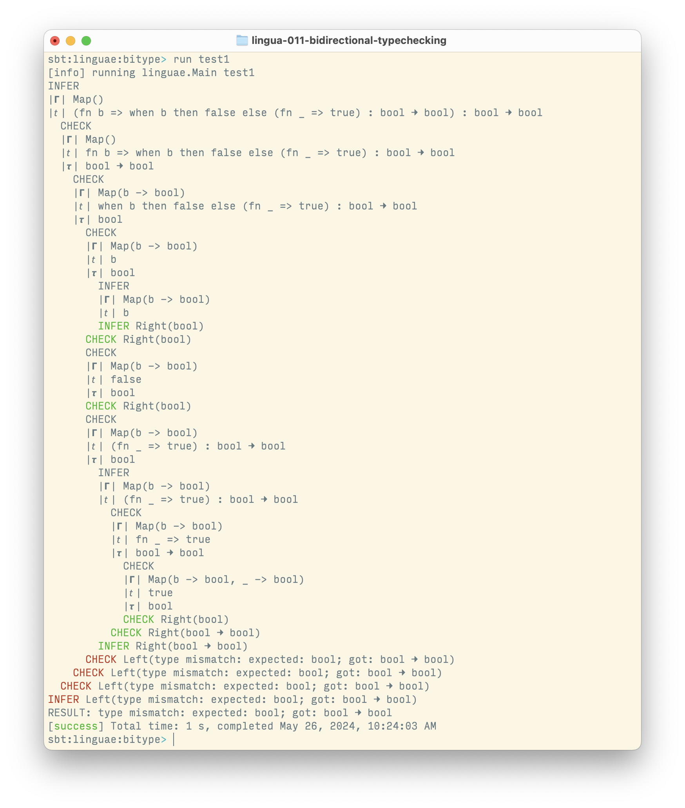

# Bidirectional Type Checking

## Resources

  - Paper: David Christiansen, [Bidirectional Typing Rules: A Tutorial][paper]
  - Video: David Christiansen, [Bidirectional Type Checking][video]

## Sample Run

[paper]: https://davidchristiansen.dk/tutorials/bidirectional.pdf
[video]: https://www.youtube.com/watch?v=utyBNDj7s2w
